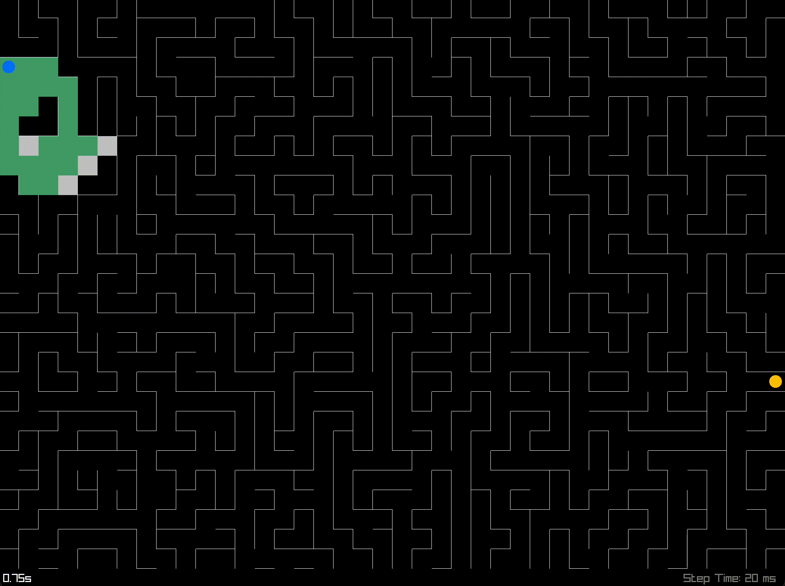
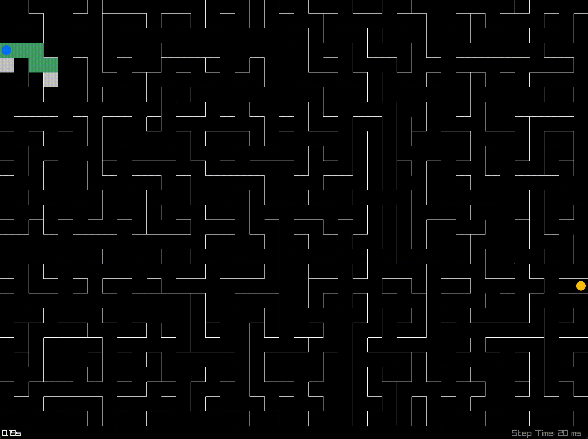
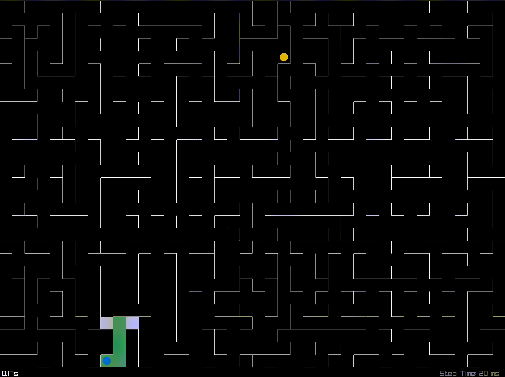

# Maze Generator and Solver made with Raylib
[Try it out!](https://obaodelana.github.io/maze-solver/web/maze-solver.html)

<em>A* Pathfinding</em>

In class, we studied elementary graph theory and some basic graph algorithms. This was my first introduction to graphs. We looked at different types of graphs (directed & undirected), basic terminologies (path, cycle, DAGs etc) and search algorithms (BFS, DFS and Dijkstra's).

In an attempt to really solidify the concepts, as I think this is a super important topic in CS, I chose to build this little app.

*DFS*

- The maze is represented as an undirected graph where each wall is an edge drawn from two neighbouring vertices.
- The maze-like pattern is randomly generated using a [randomized Depth-First Search](https://www.wikiwand.com/en/Maze_generation_algorithm#Randomized_depth-first_search) (see generator.cpp:27 for the implementation).
	> The algorithm starts at a given vertex, and randomly picks only a single neighbour that has not been looked at before. It then removes the edge connecting the vertex to its neighbour. Next, it adds the current vertex and the just removed neighbour to a stack to perform the above steps, until there is nothing left in the stack

## Search algorithms (see solver.cpp)
The algorithms are implemented in a step-wise manner. That is, when the function is called, it only performs one step of the algorithm. A timer can then be put in between successive function calls to allow for visualization.

### Depth- and Breadth-First Search
This two algorithms are very similar, in fact, they only differ by one line of code.
```c++
// Stack
if (dfs)
    container.push_front(next);
// Queue
else
    container.push_back(next);
```
The algorithms traverse (i.e., moves along) the graph while looking for the goal.
- Pick the first vertex in a container (DFS uses a stack, BFS uses a queue)
- If it is the goal vertex, return the path taken
- Skip the vertex if it has been explored before, else
- Add it to an explored list
- Look at its neighbours
	- If a neighbour has been explored, skip
	- Else, add the neighbour to the container and save the path taken to get to the vertex
- Repeat above steps until the container is empty

In essence, it just looks around until it finds what it is looking for. If it doesn't find the goal vertex, it will exit because the container would be empty.

The key difference between BFS and DFS is BFS looks at its closest neighbours first (it goes wide), while DFS looks at the last added vertex, so it goes deeper before coming back after reaching a dead end.

*BFS should always find the shortest path because closer vertices are traversed first* 
*Here, DFS doesn't find the shortest path*

### A* Pathfinding
In class, we learnt DFS, BFS and [Dijkstra's algorithm](https://www.wikiwand.com/en/Dijkstra's_algorithm), however, Dijkstra's algorithm would be not better than BFS, since a maze is an unweighted graph. So instead, I implemented the cool-sounding algorithm: A*!

Unlike DFS and BFS that have no clue where the goal is (they only know what it is), A* is an informed algorithm. It has an added cost attribute that allows the algorithm to know which vertex to explore next. The cost $f(x)$ is the sum of $g(x)$ `distance from the start` and a heuristic $h(x)$ the` estimated cost to the goal`. With this two values, it can make intelligent decisions.
- Picks the vertex with the lowest cost $f(x)$ in the container (a priority queue)
- If it is the goal, return the path taken
- Adds it to the explored list
- Looks at its neighbours
	- If the neighbour has not been explored, it adds it along with $g(x')$ and $f(x')$ to the container.  $g(x')$ is computed by adding 1 to the current vertex's $g(x)$ (since the distance from the start to its neighbour is 1)
	- Else, it checks if the `distance from the start` $g(x) + 1$ is shorter through this vertex than the neighbouring vertex's original $g(x')$
		- If it is, it adds it to the container with the updated values
		- Else, it skips the neighbour 
	(the path to get to a certain vertex is always stored)
- Repeat above steps until container is empty



## Test it out
Download [Raylib](https://www.raylib.com/), then type `make` in this directory. To run it, type `./maze-solver`.  
<strong>OR</strong>
Click [here](https://obaodelana.github.io/maze-solver/web/maze-solver.html)

- Use the left mouse button to place a start point
- Use the right mouse button to place an end point
- Press 1, 2 or 3 to start an algorithm
- Use the up and down arrow keys to increase or decrease the step time

---
This was really fun and informative. *Oh yeah, I wrote this in C++ this time!*
